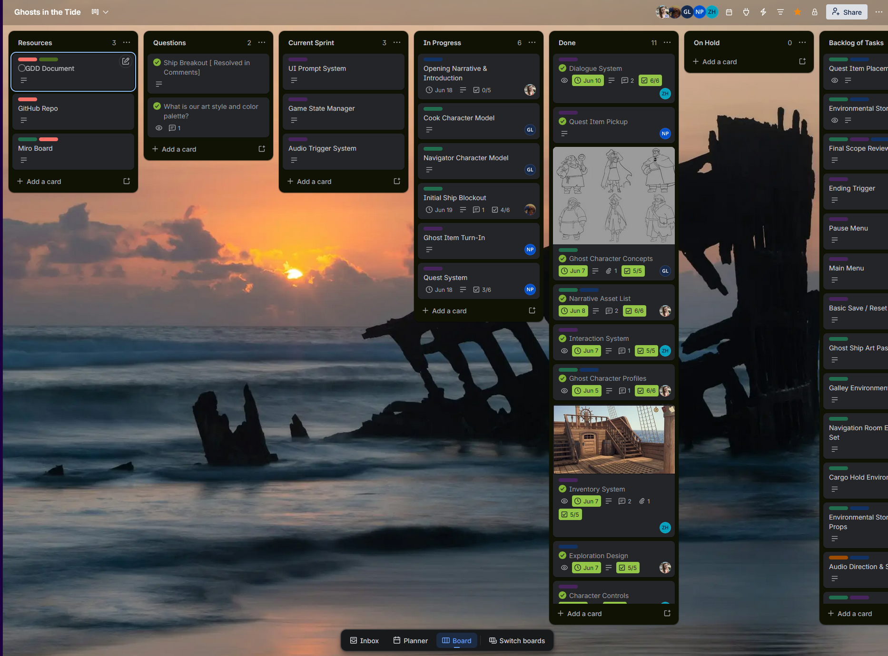
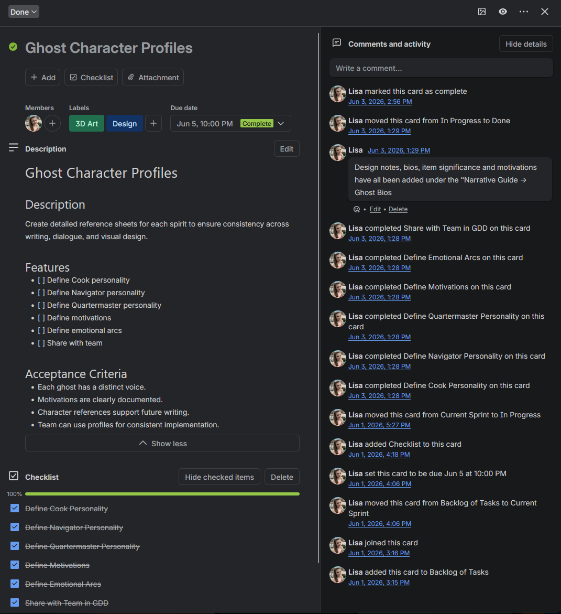
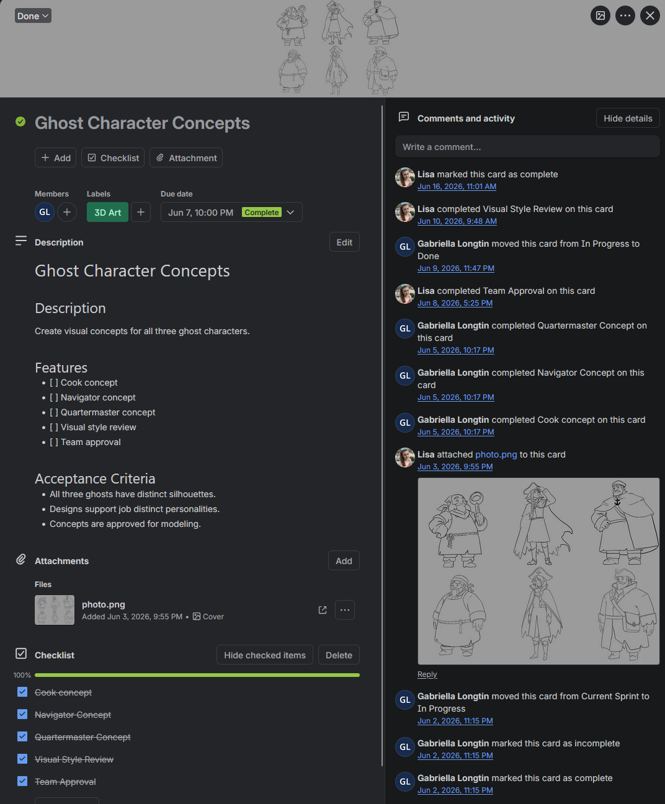

# Game Production Workflow Template

A reusable production framework designed for indie game teams, student projects, and game jams.

This workflow was created to reduce organizational overhead by standardizing sprint planning, task creation, documentation, milestone tracking, and cross-functional collaboration.

---

# Problem

Small game teams frequently encounter:

- Unclear ownership of work
- Missing requirements
- Scope creep
- Poor communication between disciplines
- Inconsistent documentation

As projects grew in complexity, I found that teams often spent significant time organizing work rather than building games.

---

# Solution

I developed a reusable workflow that standardizes:

- Sprint Planning
- Task Management
- Acceptance Criteria
- Milestone Tracking
- Cross-Discipline Coordination
- Documentation Standards

The framework is designed to be flexible enough for game jams while remaining scalable for longer-term projects.

---

# Workflow Overview

The workflow organizes work into dedicated stages:

| Stage | Purpose |
|---------|---------|
| Resources | Centralized project references |
| Questions | Open design and production questions |
| Current Sprint | Prioritized work for the active sprint |
| In Progress | Tasks actively being worked on |
| Done | Completed and approved work |
| On Hold | Blocked or delayed work |
| Backlog | Future tasks and ideas |

This structure provides visibility across the entire team while maintaining a clear development pipeline.

---

# Standardized Task Structure

Every task follows the same structure:

- Description
- Features
- Acceptance Criteria
- Ownership
- Progress Tracking
- Completion Verification

This reduces ambiguity and helps ensure deliverables meet expectations before being marked complete.

---

# Example: Narrative Design Task

This narrative task demonstrates how requirements are documented using:

- Defined objectives
- Feature checklists
- Acceptance criteria
- Progress tracking
- Team visibility

The standardized format allows narrative work to be reviewed and implemented consistently.

---

# Example: Art Production Task

Art tasks use the same framework, ensuring alignment between designers and artists.

Each task includes:

- Scope definition
- Required deliverables
- Review requirements
- Approval checkpoints

This creates a consistent production process across multiple disciplines.

---

# Included Templates

- [Task Template](templates/task-template.md)
- [Sprint Template](templates/sprint-template.md)
- [Milestone Template](templates/milestone-template.md)
- [Project Template](templates/project-template.md)

## Task Template

Used for individual work items.

Location:

templates/task-template.md

---

## Sprint Template

Used to organize short development cycles.

Location:

templates/sprint-template.md

---

## Milestone Template

Used to define major project goals and deliverables.

Location:

templates/milestone-template.md

---

## Project Template

Used to establish project structure and planning documentation.

Location:

templates/project-template.md

---

# Results

This workflow has been used to coordinate:

- Narrative Design
- Game Design
- Programming
- Environment Art
- Character Art
- Audio Planning

By standardizing task structure and project organization, the framework reduces setup time and improves visibility across small development teams.

---

# Future Improvements

Potential future additions include:

- Automated sprint reporting
- Velocity tracking
- Team dashboards
- Dependency management tools
- Production analytics

---

# License

This repository is shared as a learning resource and example production framework for indie game development teams.